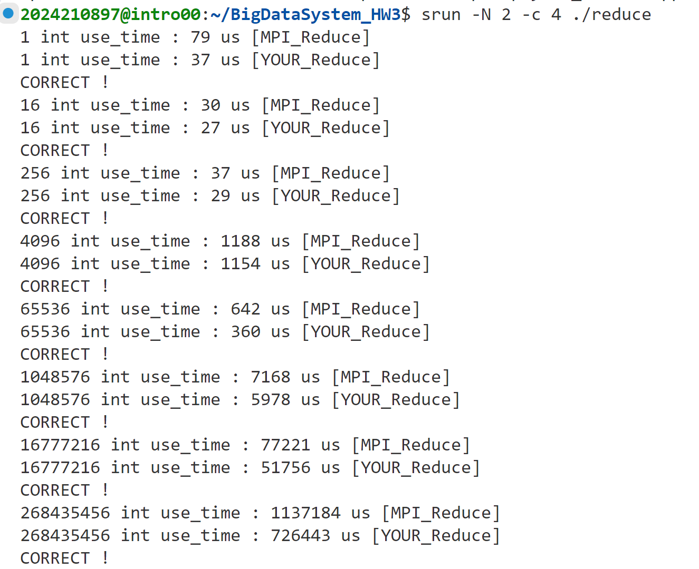
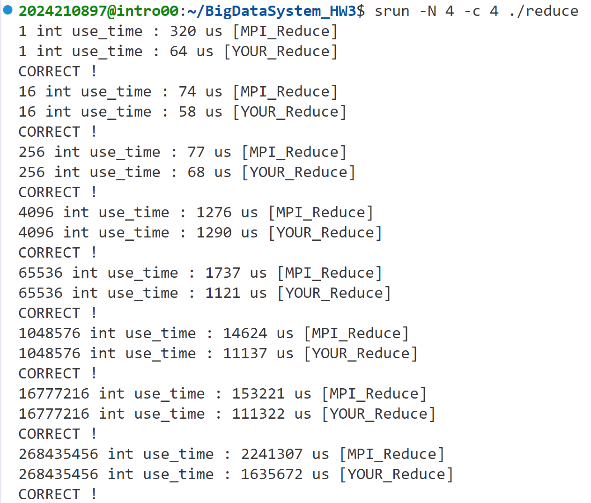

# 实验报告
## 实现方法
为加快运行速度，对总进程数为2的情况进行单独考虑，0号进程将收到的来自1号进程数据直接存入`recvbuf`中，并与自身数据相加即可。
对于总进程数`size>2`的情况，初始化一段缓冲区用于存储接收到的数据，使用二进制树的思想，对进程号的二进制表示为$[b_n,b_{n-1},\cdots,b_0]_2$，其中$b_n$为最高位，$b_0$为最低位，设其尾部有$k+1$个0，则其需要接收来自从进程号为$[b_n,b_{n-1},\cdots,b_k,0,\cdots,1]_2$到$[b_n,b_{n-1},\cdots,b_k,1,\cdots,1]_2$的数据，将其存入缓冲区中，然后与自身数据相加，最后将结果发送给进程号为$[b_n,b_{n-1},\cdots,b_{k+1},0,\cdots,0]_2$的进程。为了减少第一轮对数据的拷贝，此处使用了`init_recv`判断`recvbuf`存入的值是否是有效值。

## 一些尝试
代码中也包括了我最初使用的单进程相加代码，注释掉USE_PARALLEL宏即可运行，该部分时间明显长于并行计算的时间。
同时我也尝试了依据下标进行分组，添加定义PARALLEL_BY_INDEX宏即可运行，每个进程处理自己的下标并将结果相加至0号进程，但不知道为什么时间也明显长于二进制树的方法。

## 实验结果
2进程，4线程结果：

4进程，4线程结果：

表格展示（单位：us）：
| 数组长度 | 2进程 | 4进程 |
| -------- | ------------ | ------------ |
| 64k | 360 | 1121 |
| 1M | 5978 | 11137 |
| 16M | 51756 | 111322 |
| 256M | 726443 | 1635672 |

## bonus
### 实现方法：
采用了比较简洁的实现方法，在原始程序的基础上，在初始位置添加并行块创建并行线程，对每个进程的数据进行了分块，进程中的每个线程只处理自己的数据块（例如总共t个线程时，进程0中的线程0处理0\~n/t-1的数据，线程1处理n/t\~2n/t-1的数据，以此类推），每个线程在发送数据时只发送自己的数据块，并设置MPI_Send的tag为进程号，接收数据时只接收自己的数据块，最后将每个线程的结果合并即可。

### 实验结果：
由于结果较长，在此仅列举数据量256M时的结果。N代表进程数，c代表线程数，时间单位为us。具体结果如下：
* N2, c4: 533230
* N2, c3: 610633
* N2, c2: 715632
* N2, c1: 8607108
* N4, c4: 1910383
* N4, c3: 9673953
* N4, c2: 10608974
* N4, c1: 20111229

观察发现相比于没有使用omp时，使用之后的时间反而更长，猜测是由于原本程序被机器自动并行处理了，而我自己写的并行代码无法保证线程之间负载均衡，导致了时间增加。还有一个比较奇怪的现象，就是在2个进程、单线程时，时间相比于多线程呈不正常的10倍增长，我测试了很多次都是这个结果，目前还没有找到原因。